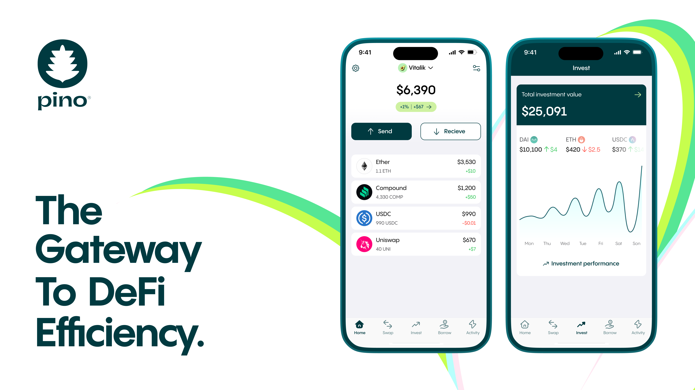

</img>
Pino is a DeFi-centric mobile wallet, aiming to maximize your efficiency in DeFi through elevating user experience, security, and insights.
- **Experience**: Unlike conventional wallets that rely on embedded web browsers for dApp interactions, Pino utilizes dedicated mobile-native interfaces to allow lag-free and seamless user experiences for your DeFi activities.
- **Security**: Pino routes your transactions through a proxy contract powered by Permit 2 that limits the token access to the transaction amount. It significantly secures your wallet, especially in the event of protocol hacks.
- **Insights**: Pino shifts the narrative from mere asset price reporting to a more meaningful representation of your portfolio performance against USD over time, giving you a clearer understanding of your actual financial gains.

## Installation Guide

### Prerequisites
- **Xcode**: Ensure Xcode is installed on your system.
- **CocoaPods**: If you don't have CocoaPods installed, you can install it by running:

  ```bash
  sudo gem install cocoapods
  ```

### Clone the Repository
Clone the repository to your local machine:
```bash
git clone git@github.com:pino-wallet/pino-ios.git
cd pino-ios
```

### Install Dependencies

### CocoaPods Managed Libraries
1. Make sure the `Podfile` is properly configured with the libraries.
2. Open a terminal window and navigate to the repository directory.
3. Run the following command:

   ```bash
   pod install
   ```
   This will download and install all CocoaPods dependencies specified in the `Podfile`.

#### Libraries:

1. **TrustWalletCore**: [https://github.com/trustwallet/wallet-core](https://github.com/trustwallet/wallet-core)
2. **FirebaseMessaging**: [https://github.com/firebase/firebase-ios-sdk](https://github.com/firebase/firebase-ios-sdk)
  
### Locally Managed Libraries
1. The local libraries need to be placed in the `Libraries` folder as indicated in folder structure section.
2. Follow these steps:
   - Download or clone each library.
   - Place them in the `Libraries` folder maintaining the structure:
     - **Web3-Utility** [https://github.com/pino-wallet/Web3-Utility](https://github.com/pino-wallet/Web3-Utility)
     - **BigInt** [https://github.com/attaswift/BigInt](https://github.com/attaswift/BigInt)
     - **Charts (DGCharts)**: [https://github.com/danielgindi/Charts](https://github.com/danielgindi/Charts)
     - **OHHTTPStubs**: [https://github.com/AliSoftware/OHHTTPStubs](https://github.com/AliSoftware/OHHTTPStubs)
     - **Hyperconnectivity** [https://github.com/rwbutler/Hyperconnectivity](https://github.com/rwbutler/Hyperconnectivity)
     - **Kingfisher**: [https://github.com/onevcat/Kingfisher](https://github.com/onevcat/Kingfisher)
     - **Web3** [https://github.com/Boilertalk/Web3.swift](https://github.com/Boilertalk/Web3.swift)
     - **Lottie**: [https://github.com/airbnb/lottie-ios](https://github.com/airbnb/lottie-ios)


### Open the Project
- Open the `.xcworkspace` file created by CocoaPods in Xcode.
- Build the project using `Command + B`.

### Folder Structure

Here's the structure of the project:

```
<repository_name>
├── Libraries
│   ├── Web3-Utility
│   ├── BigInt
│   ├── DGCharts
│   ├── CryptoSwift
│   ├── OHHTTPStubs
│   ├── Hyperconnectivity
│   ├── Kingfisher
│   ├── Web3
│   └── Lottie
├── pino-ios
│   ├── Pino-iOS
│   ├── package.json
│   ├── package-lock.json
│   └── commitlint.config.js
```

### Library References

#### Locally Managed Libraries
1. **Charts (DGCharts)**: [https://github.com/danielgindi/Charts](https://github.com/danielgindi/Charts)
2. **CryptoSwift**: [https://github.com/krzyzanowskim/CryptoSwift](https://github.com/krzyzanowskim/CryptoSwift)
3. **OHHTTPStubs**: [https://github.com/AliSoftware/OHHTTPStubs](https://github.com/AliSoftware/OHHTTPStubs)
4. **Kingfisher**: [https://github.com/onevcat/Kingfisher](https://github.com/onevcat/Kingfisher)
5. **Lottie**: [https://github.com/airbnb/lottie-ios](https://github.com/airbnb/lottie-ios)
